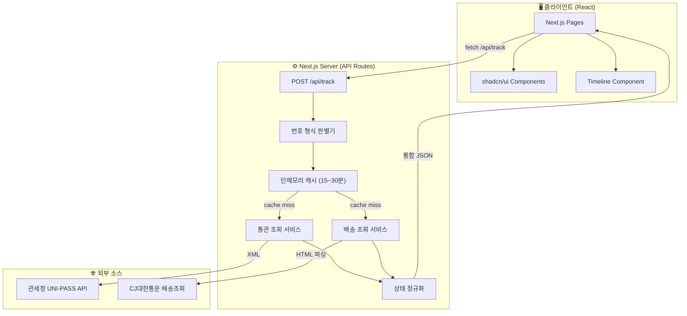
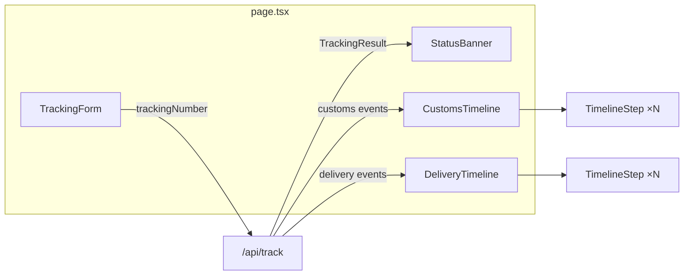

# 📦 통관 및 국내 배송 조회 웹 서비스 — 개발계획서

> ※ 본 문서는 **ChemiCloud Shared Hosting** 환경 (`tipoasis.com`)을 기준으로 작성되었으며,
> 향후 서비스 확장 시 VPS 또는 클라우드 환경 이전을 고려한다.

> **프로젝트명:** 통관정보 웹페이지 (Customs & Delivery Tracker)
> **작성일:** 2026-02-16
> **운영 URL:** `https://tracking.tipoasis.com`
> **목적:** 구매대행 고객 CS 문의 감소를 위한 단일 조회 페이지 내부 서비스
> **레퍼런스:** [customstrack.com](https://customstrack.com)
> **호스팅:** ChemiCloud Shared Hosting (Setup Node.js App)

---

## 1. 프로젝트 개요

### 1.1 서비스 목적
| 항목 | 설명 |
|------|------|
| **CS 감소** | 고객이 직접 통관/배송 상태를 조회하여 CS 인입 최소화 |
| **실시간 확인** | 통관 진행 여부를 실시간으로 파악 |
| **인계 명확화** | 통관 완료 → 국내 택배 인계 시점을 시각적으로 표현 |
| **개인정보 보호** | 조회 기록 미저장, 최소 데이터 수집 |

### 1.2 핵심 기능 요약
```
[사용자 입력] → [번호 형식 자동 판별] → [서버 API 호출]
                                            ├─ 관세청 UNI-PASS (통관)
                                            └─ CJ대한통운 (국내 배송)
                                       → [통합 타임라인 표시]
```

### 1.3 활용 스킬

| 스킬 | 용도 |
|------|------|
| **web-artifacts-builder** | React + TypeScript + Tailwind CSS + shadcn/ui 컴포넌트 활용 |
| **webapp-testing** | Playwright 기반 E2E 테스트 및 UI 검증 |
| **doc-coauthoring** | 본 개발계획서 공동 작성 워크플로우 참고 |

---

## 2. 시스템 아키텍처

### 2.1 전체 구성도



### 2.2 기술 스택

| 계층 | 기술 | 선택 이유 |
|------|------|-----------|
| **프레임워크** | Next.js 14 (App Router) | 풀스택 통합, SSR/SSG, API Routes 내장 |
| **언어** | TypeScript | 타입 안전성, 자동 완성, 유지보수성 |
| **UI 라이브러리** | React 18 | 컴포넌트 기반, 타임라인 UI 구현에 최적 |
| **스타일링** | Tailwind CSS 3.4 | 유틸리티 기반 CSS, 빠른 스타일 개발 |
| **UI 컴포넌트** | shadcn/ui | 고품질 Radix UI 기반, 접근성 내장, 커스터마이징 용이 |
| **캐싱** | node-cache (인메모리) | 별도 Redis 불필요, 단순 조회 서비스에 적합 |
| **XML 파싱** | xml2js | UNI-PASS XML 응답 → JSON 변환 |
| **HTML 파싱** | cheerio | CJ대한통운 배송조회 HTML → 데이터 추출 |
| **HTTP 클라이언트** | fetch (내장) | Next.js 내장 fetch, 외부 의존성 불필요 |
| **검증** | Zod | API 입력/응답 스키마 런타임 검증 |
| **배포** | ChemiCloud Shared Hosting (Node.js App) | Setup Node.js App 기능 활용, `tracking.tipoasis.com` 서브도메인 |
| **E2E 테스트** | Playwright | webapp-testing 스킬 연계 |

---

## 3. 데이터 소스 상세

### 3.1 관세청 UNI-PASS OpenAPI

> [!IMPORTANT]
> API 이용을 위해 [UNI-PASS](https://unipass.customs.go.kr/) 회원가입 후 **OpenAPI 사용 신청**이 필요합니다.

| 항목 | 내용 |
|------|------|
| **API명** | 화물통관 진행정보 조회 |
| **신청경로** | My 메뉴 > 서비스관리 > OpenAPI 사용관리 |
| **조회키** | HBL(House B/L) 또는 화물관리번호 |
| **응답형식** | XML |
| **조회범위** | 최근 3년 이내 통관 데이터 |
| **주요 파라미터** | 인증키, B/L번호, 발행연도 |

**통관 이벤트 추출 대상:**
```
입항 → 하선신고 → 반입신고 → 수입신고 → 수입신고수리 → 물품반출
```

### 3.2 CJ대한통운 배송조회 (Phase 1)

> [!NOTE]
> Phase 1에서는 **CJ대한통운만** 지원합니다.
> 다른 택배사(한진, 로젠 등)는 추후 확장 시 SweetTracker API 또는 개별 택배사 연동을 고려합니다.

| 항목 | 내용 |
|------|------|
| **조회 방식** | CJ대한통운 공식 배송조회 페이지 HTML 파싱 (서버사이드) |
| **조회 URL** | `https://trace.cjlogistics.com/next/tracking.html?wblNo={운송장번호}` |
| **파라미터** | `wblNo` (운송장번호) |
| **응답형식** | HTML → cheerio로 파싱하여 배송 이벤트 추출 |
| **지원 택배사** | CJ대한통운 (Phase 1) |
| **별도 API 키** | ❌ 불필요 (공개 조회 페이지) |
| **제한사항** | 과도한 요청 시 차단 가능 → 캐싱(15분)으로 대응 |

**조회 페이지:** [https://trace.cjlogistics.com](https://trace.cjlogistics.com)

> [!TIP]
> **추후 확장 계획:** 타 택배사 지원 필요 시 아래 옵션 검토
> - SweetTracker API (유료 플랜)
> - Delivery Tracker V2 API
> - 개별 택배사 배송조회 페이지 파싱 추가

---

## 4. 프로젝트 구조

### 4.1 디렉토리 구조

```
05. 통관정보 웹페이지 생성/
├── app/                          # Next.js App Router
│   ├── layout.tsx                # 루트 레이아웃 (Pretendard 폰트, 메타데이터)
│   ├── page.tsx                  # 메인 조회 페이지
│   ├── globals.css               # Tailwind 글로벌 스타일 + 커스텀 CSS
│   └── api/
│       └── track/
│           └── route.ts          # POST /api/track — 통합 조회 API
│
├── components/                   # React 컴포넌트
│   ├── ui/                       # shadcn/ui 컴포넌트 (자동 설치)
│   │   ├── button.tsx
│   │   ├── input.tsx
│   │   ├── card.tsx
│   │   ├── badge.tsx
│   │   ├── skeleton.tsx
│   │   └── alert.tsx
│   ├── TrackingForm.tsx          # 조회 입력 폼
│   ├── StatusBanner.tsx          # 현재 상태 헤더 배너
│   ├── CustomsTimeline.tsx       # 통관 타임라인
│   ├── DeliveryTimeline.tsx      # 배송 타임라인
│   ├── TimelineStep.tsx          # 타임라인 개별 스텝
│   ├── ErrorMessage.tsx          # 에러 표시
│   └── LoadingSpinner.tsx        # 로딩 애니메이션
│
├── lib/                          # 서버/공통 유틸리티
│   ├── services/
│   │   ├── customs.ts            # UNI-PASS API 호출 & XML 파싱
│   │   ├── delivery.ts           # CJ대한통운 배송조회 HTML 파싱
│   │   ├── identifier.ts         # 번호 형식 자동 판별
│   │   └── normalizer.ts         # 상태 정규화 & 타임라인 통합
│   ├── cache.ts                  # 인메모리 캐시 래퍼
│   ├── schemas.ts                # Zod 스키마 (입력/출력 타입)
│   ├── types.ts                  # TypeScript 타입 정의
│   └── utils.ts                  # 공통 유틸리티
│
├── public/
│   └── favicon.ico
│
├── tests/                        # E2E 테스트 (Playwright)
│   └── tracking.spec.ts
│
├── next.config.js
├── tailwind.config.ts
├── tsconfig.json
├── components.json               # shadcn/ui 설정
├── package.json
├── .env.local                    # 환경변수 (API 키)
├── .env.example                  # 환경변수 템플릿
├── Plan.md                       # 본 개발계획서
└── README.md
```

### 4.2 번호 형식 자동 판별 로직

```typescript
// lib/services/identifier.ts
type TrackingType = 'HBL' | 'DOMESTIC' | 'CARGO' | 'UNKNOWN';

interface IdentifyResult {
  type: TrackingType;
  number: string;
}

export function identifyTrackingNumber(input: string): IdentifyResult {
  const cleaned = input.replace(/[\s-]/g, '');

  // HBL/BL 패턴 (영문+숫자 조합, 보통 12~20자리)
  if (/^[A-Z]{3,4}\d{8,16}$/i.test(cleaned)) {
    return { type: 'HBL', number: cleaned };
  }

  // 국내 운송장 (순수 숫자 10~14자리)
  if (/^\d{10,14}$/.test(cleaned)) {
    return { type: 'DOMESTIC', number: cleaned };
  }

  // 화물관리번호 패턴
  if (/^\d{15,}$/.test(cleaned)) {
    return { type: 'CARGO', number: cleaned };
  }

  return { type: 'UNKNOWN', number: cleaned };
}
```

### 4.3 상태 정규화 매핑

통관 및 배송 이벤트를 **7단계 통합 상태**로 정규화:

| 단계 | 통합 상태 | UNI-PASS 이벤트 | SweetTracker 이벤트 |
|------|-----------|------------------|---------------------|
| 1 | 🛬 **입항** | 입항 보고 | — |
| 2 | 📋 **통관 접수** | 수입신고 접수 | — |
| 3 | 🔍 **통관 심사중** | 심사 진행 | — |
| 4 | ✅ **통관 완료** | 수입신고수리 / 물품반출 | — |
| 5 | 📦 **국내 배송 인계** | — | 인수 |
| 6 | 🚛 **배송중** | — | 배송중 / 간선상차 등 |
| 7 | 🏠 **배송완료** | — | 배달완료 |

### 4.4 API 응답 캐싱 전략

```typescript
// lib/cache.ts
import NodeCache from 'node-cache';

const cache = new NodeCache({
  stdTTL: 900,      // 기본 15분
  checkperiod: 120   // 2분마다 만료 체크
});

// 캐시 키: "track:{type}:{number}"
// 예: "track:HBL:ABCD1234567890"
```

| 설정 | 값 | 이유 |
|------|-----|------|
| **TTL** | 15분 (900초) | 통관/배송 데이터 갱신 주기 고려 |
| **최대 TTL** | 30분 (1800초) | 외부 API 부하 방지 |
| **캐시 전략** | Cache-Aside | 단순성 — miss 시에만 API 호출 |

---

## 5. 프론트엔드 설계

### 5.1 UI 레이아웃 구조

```
┌──────────────────────────────────────────────┐
│              🔍 통관 · 배송 조회              │
│                                              │
│  ┌──────────────────────────────────────┐     │
│  │  운송장 / HBL 번호 입력               │  🔍 │
│  └──────────────────────────────────────┘     │
│                                              │
│  ═══════════════════════════════════════════  │
│                                              │
│  📊 현재 상태: ✅ 통관 완료                   │
│  ━━━━━━━━━━━━━━━━━━━━━━━━━━━━━━━━━━━━━━━━━  │
│                                              │
│  ┌─ 통관 진행상황 ──────────────────────┐     │
│  │  ● 입항              2026-02-14 09:30 │    │
│  │  ● 통관 접수          2026-02-14 11:00 │    │
│  │  ● 통관 심사중        2026-02-14 14:20 │    │
│  │  ◉ 통관 완료          2026-02-15 10:00 │    │
│  └──────────────────────────────────────┘     │
│                                              │
│  ┌─ 국내 배송 진행상황 ────────────────┐      │
│  │  택배사: CJ대한통운                    │     │
│  │  ● 배송 인계          2026-02-15 14:00 │    │
│  │  ◉ 배송중 (인천 허브)  2026-02-15 18:30 │   │
│  │  ○ 배송완료            —               │    │
│  └──────────────────────────────────────┘     │
│                                              │
│  최종 업데이트: 2026-02-15 18:30              │
└──────────────────────────────────────────────┘
```

### 5.2 디자인 가이드라인

> [!TIP]
> `web-artifacts-builder` 스킬 가이드에 따라, "AI slop" 방지를 위해 과도한 중앙 정렬, 보라 그라디언트, 균일한 둥근 모서리를 지양합니다.

| 항목 | 사양 |
|------|------|
| **컬러 팔레트** | 다크 모드 기반, 슬레이트(Slate) 배경 + 에메랄드(Emerald) 액센트 |
| **폰트** | Google Fonts — Pretendard (한글) + Geist (영문/숫자) |
| **UI 컴포넌트** | shadcn/ui (Card, Badge, Input, Button, Skeleton, Alert) |
| **타임라인** | 세로형 스텝퍼, 현재 단계 펄스 애니메이션 |
| **상태 표기** | 완료(●), 현재(◉ pulse), 대기(○) |
| **반응형** | 모바일 우선, `max-w-2xl` 중심 레이아웃 |
| **마이크로 인터랙션** | 조회 버튼 리플, 결과 `framer-motion` 슬라이드, 타임라인 순차 등장 |

### 5.3 Tailwind 커스텀 테마

```typescript
// tailwind.config.ts — 커스텀 색상 확장
const config = {
  theme: {
    extend: {
      colors: {
        background: 'hsl(222, 47%, 6%)',    // 딥 네이비
        card: 'hsl(220, 30%, 12%)',          // 카드 배경
        accent: {
          success: 'hsl(156, 100%, 42%)',    // 에메랄드 (완료)
          warning: 'hsl(38, 100%, 64%)',     // 앰버 (진행중)
          info: 'hsl(195, 85%, 62%)',        // 스카이블루 (정보)
          error: 'hsl(0, 100%, 71%)',        // 코랄 (오류)
        },
      },
      fontFamily: {
        sans: ['Pretendard', 'Geist', 'sans-serif'],
        mono: ['Geist Mono', 'monospace'],
      },
      animation: {
        'pulse-glow': 'pulse-glow 2s ease-in-out infinite',
        'slide-up': 'slide-up 0.4s ease-out',
        'fade-in': 'fade-in 0.3s ease-out',
      },
    },
  },
};
```

### 5.4 핵심 컴포넌트 설계



| 컴포넌트 | shadcn/ui 사용 | 역할 |
|----------|----------------|------|
| `TrackingForm` | Input, Button | 번호 입력 + 조회 버튼 |
| `StatusBanner` | Card, Badge | 현재 상태 강조 표시 |
| `CustomsTimeline` | Card | 통관 이벤트 세로 타임라인 |
| `DeliveryTimeline` | Card | 배송 이벤트 세로 타임라인 |
| `TimelineStep` | — (커스텀) | 개별 스텝 (●/◉/○ + 시간) |
| `ErrorMessage` | Alert | 에러 안내 메시지 |
| `LoadingSpinner` | Skeleton | 조회 중 로딩 상태 |

---

## 6. 보안 요구사항

| 항목 | 구현 방식 |
|------|-----------|
| **API 키 보호** | `.env.local` — 서버 컴포넌트/API Route에서만 접근 (`NEXT_PUBLIC_` 미사용) |
| **클라이언트 제한** | 클라이언트 → Next.js API Route만 호출, 외부 API 직접 호출 차단 |
| **CORS** | Next.js 미들웨어에서 `tracking.tipoasis.com` 도메인만 허용 |
| **Rate Limiting** | `next-rate-limit` 또는 커스텀 미들웨어 — IP당 분당 30회 제한 |
| **입력 검증** | Zod 스키마로 서버사이드 runtime 검증 |
| **HTTPS** | ChemiCloud 무료 SSL (AutoSSL / Let's Encrypt) |

---

## 7. 개발 로드맵

### Phase 1: 프로젝트 초기화 (0.5일)

- [ ] Next.js 14 프로젝트 생성 (`npx create-next-app@latest`)
- [ ] TypeScript + Tailwind CSS + ESLint 설정
- [ ] shadcn/ui 초기화 (`npx shadcn-ui@latest init`)
- [ ] 필요 컴포넌트 설치 (Button, Input, Card, Badge, Skeleton, Alert)
- [ ] 환경변수 설정 (`.env.local`, `.env.example`)
- [ ] Pretendard + Geist 폰트 설정

### Phase 2: 백엔드 API 개발 (2일)

- [ ] TypeScript 타입 정의 (`types.ts`, `schemas.ts`)
- [ ] 번호 형식 판별기 (`identifier.ts`)
- [ ] UNI-PASS API 연동 + XML 파싱 (`customs.ts`)
- [ ] CJ대한통운 배송조회 HTML 파싱 연동 (`delivery.ts`)
- [ ] 상태 정규화 모듈 (`normalizer.ts`)
- [ ] 인메모리 캐시 (`cache.ts`)
- [ ] API Route 구현 (`app/api/track/route.ts`)

### Phase 3: 프론트엔드 컴포넌트 개발 (2일)

- [ ] `TrackingForm` — 조회 입력 + 자동 판별 피드백
- [ ] `StatusBanner` — 현재 상태 카드 (배지 + 아이콘)
- [ ] `CustomsTimeline` + `DeliveryTimeline` — 세로 타임라인
- [ ] `TimelineStep` — 개별 스텝 (상태별 스타일링)
- [ ] `ErrorMessage` + `LoadingSpinner`
- [ ] 메인 페이지 조립 (`page.tsx`)

### Phase 4: 스타일링 & 마이크로 인터랙션 (1일)

- [ ] 다크 모드 테마 적용 (Tailwind 커스텀)
- [ ] 글래스모피즘 카드 스타일
- [ ] 타임라인 순차 `fade-in` 애니메이션
- [ ] 현재 단계 `pulse-glow` 효과
- [ ] 반응형 레이아웃 검증 (모바일 / 데스크탑)

### Phase 5: 테스트 & 배포 (1일)

- [ ] Playwright E2E 테스트 작성 (`webapp-testing` 스킬 활용)
- [ ] 에러 케이스 검증 (잘못된 번호, API 타임아웃, 결과 없음)
- [ ] Next.js 프로덕션 빌드 (`next build` → `next start`)
- [ ] ChemiCloud cPanel에서 Node.js App 등록 (Node 18+)
- [ ] `tracking.tipoasis.com` 서브도메인 연결
- [ ] 환경변수 ChemiCloud Node App 설정에서 등록
- [ ] SSL 인증서 확인 (ChemiCloud AutoSSL)

> **예상 총 개발 기간: 6~7일**

---

## 8. 의존성 패키지

```json
{
  "dependencies": {
    "next": "^14.x",
    "react": "^18.x",
    "react-dom": "^18.x",
    "xml2js": "^0.6.x",
    "cheerio": "^1.0.x",
    "node-cache": "^5.1.x",
    "zod": "^3.x",
    "framer-motion": "^11.x",
    "class-variance-authority": "^0.7.x",
    "clsx": "^2.x",
    "tailwind-merge": "^2.x",
    "lucide-react": "^0.x",
    "@radix-ui/react-slot": "^1.x"
  },
  "devDependencies": {
    "typescript": "^5.x",
    "tailwindcss": "^3.4.x",
    "postcss": "^8.x",
    "autoprefixer": "^10.x",
    "@playwright/test": "^1.x",
    "@types/node": "^20.x",
    "@types/react": "^18.x"
  }
}
```

---

## 9. API 엔드포인트 명세

### `POST /api/track`

**Request:**
```json
{
  "trackingNumber": "ABCD1234567890"
}
```

**Zod 스키마:**
```typescript
// lib/schemas.ts
import { z } from 'zod';

export const TrackRequestSchema = z.object({
  trackingNumber: z.string()
    .min(1, '조회번호를 입력해주세요')
    .max(30, '번호가 너무 깁니다')
    .trim(),
});
```

**Response (성공):**
```json
{
  "success": true,
  "data": {
    "trackingNumber": "ABCD1234567890",
    "type": "HBL",
    "currentStatus": "통관 완료",
    "currentStatusCode": 4,
    "customs": {
      "events": [
        {
          "status": "입항",
          "statusCode": 1,
          "datetime": "2026-02-14T09:30:00+09:00",
          "location": "인천공항",
          "detail": "항공화물 입항"
        }
      ]
    },
    "delivery": {
      "carrier": "CJ대한통운",
      "carrierCode": "04",
      "invoiceNumber": "1234567890",
      "events": [
        {
          "status": "배송 인계",
          "statusCode": 5,
          "datetime": "2026-02-15T14:00:00+09:00",
          "location": "인천 물류센터",
          "detail": "택배사 인수"
        }
      ]
    },
    "timeline": [
      {
        "step": 1,
        "label": "입항",
        "completed": true,
        "datetime": "2026-02-14T09:30:00+09:00"
      }
    ],
    "lastUpdated": "2026-02-15T18:30:00+09:00"
  }
}
```

**Response (에러):**
```json
{
  "success": false,
  "error": {
    "code": "INVALID_NUMBER",
    "message": "입력하신 번호의 형식을 확인할 수 없습니다. HBL 또는 국내 운송장 번호를 다시 확인해주세요."
  }
}
```

---

## 10. 에러 처리 전략

| 에러 유형 | 코드 | 사용자 메시지 |
|-----------|------|---------------|
| 형식 불일치 | `INVALID_NUMBER` | 입력하신 번호의 형식을 확인할 수 없습니다 |
| API 타임아웃 | `API_TIMEOUT` | 조회 서비스에 일시적인 문제가 있습니다. 잠시 후 다시 시도해주세요 |
| 조회 결과 없음 | `NOT_FOUND` | 해당 번호로 통관/배송 정보를 찾을 수 없습니다 |
| 서버 에러 | `SERVER_ERROR` | 시스템 오류가 발생했습니다. 관리자에게 문의해주세요 |
| Rate Limit | `RATE_LIMITED` | 조회 요청이 너무 많습니다. 1분 후 다시 시도해주세요 |

---

## 11. 검증 계획

### 자동화 테스트 (Playwright — `webapp-testing` 스킬)

```bash
# 서버 시작 + E2E 테스트 실행
python scripts/with_server.py --server "npm run dev" --port 3000 -- python tests/tracking.spec.ts
```

| 테스트 케이스 | 검증 내용 |
|---------------|-----------|
| 페이지 로드 | 입력 필드와 조회 버튼이 렌더링되는지 확인 |
| HBL 조회 | HBL 번호 입력 → 통관 타임라인 표시 확인 |
| 운송장 조회 | 운송장 번호 입력 → 배송 타임라인 표시 확인 |
| 잘못된 번호 | 잘못된 형식 입력 → 에러 메시지 표시 확인 |
| 빈 입력 | 빈 값 제출 → 유효성 검증 에러 확인 |
| 로딩 상태 | 조회 중 스켈레톤/스피너 표시 확인 |
| 반응형 | 모바일 뷰포트에서 레이아웃 깨짐 없는지 확인 |

### 수동 검증

1. **브라우저에서** `http://localhost:3000` 접속
2. 실제 HBL 번호 / 운송장 번호 입력 후 결과 확인
3. 다크 모드 UI, 애니메이션, 반응형 레이아웃 육안 검증

---

## 12. 사전 준비 체크리스트

> [!CAUTION]
> 개발 착수 전 아래 항목이 **반드시** 완료되어야 합니다.

- [ ] **UNI-PASS 회원가입** 및 OpenAPI 사용 신청 → 인증키 수령
- [ ] CJ대한통운 배송조회 페이지 접근 확인 (`trace.cjlogistics.com`)
- [ ] ChemiCloud cPanel에서 Node.js 18+ 사용 가능 여부 확인
- [ ] `tracking.tipoasis.com` 서브도메인 생성 (cPanel > Subdomains)
- [ ] ChemiCloud AutoSSL로 서브도메인 SSL 적용 확인

---

## 13. 참고 자료

| 항목 | URL |
|------|-----|
| 관세청 UNI-PASS | https://unipass.customs.go.kr/ |
| 공공데이터포털 (화물통관 API) | https://www.data.go.kr/ |
| CJ대한통운 배송조회 | https://trace.cjlogistics.com |
| 레퍼런스 (customstrack.com) | https://customstrack.com |
| Next.js 공식문서 | https://nextjs.org/docs |
| shadcn/ui 컴포넌트 | https://ui.shadcn.com/docs/components |
| Tailwind CSS | https://tailwindcss.com/docs |
| ChemiCloud Node.js 호스팅 | https://www.chemicloud.com/ |
| Framer Motion | https://www.framer.com/motion/ |
| Zod 스키마 검증 | https://zod.dev/ |
| xml2js (npm) | https://www.npmjs.com/package/xml2js |

---

## 14. 운영 환경

### 14.1 호스팅 구조

```
┌─────────────────────────────────────────────────────┐
│              ChemiCloud Shared Hosting               │
├─────────────────────────────────────────────────────┤
│                                                     │
│  tipoasis.com            → WordPress (브랜드/랜딩)  │
│  tracking.tipoasis.com   → Next.js 14 (통관·배송)   │
│  admin.tipoasis.com      → 내부 관리 (추후 확장)    │
│                                                     │
└─────────────────────────────────────────────────────┘
```

### 14.2 ChemiCloud Node.js App 배포 절차

1. cPanel > **Setup Node.js App** 접속
2. **Application root:** `tracking.tipoasis.com` 디렉토리 지정
3. **Application URL:** `tracking.tipoasis.com`
4. **Node.js version:** 18 이상 선택
5. **Application startup file:** `server.js` 또는 Next.js standalone 빌드 진입점
6. **Environment variables:** 설정 화면에서 직접 등록
7. **Run NPM Install** 클릭
8. **Start App** 클릭

> [!NOTE]
> ChemiCloud Shared Hosting에서 Next.js를 실행하려면 `next build` 후 `standalone` 출력을 사용하거나,
> `next start`를 Passenger로 프록시하는 구성이 필요할 수 있습니다.

### 14.3 next.config.js 권장 설정

```javascript
// next.config.js
const nextConfig = {
  output: 'standalone',  // ChemiCloud 배포용 standalone 빌드
  // ... 기타 설정
};
module.exports = nextConfig;
```

---

## 15. 환경변수 정책

> [!WARNING]
> `.env.local` 파일은 **Git 저장소에 포함하지 않는다.**
> 환경변수는 ChemiCloud Node App 설정 화면에서 직접 등록한다.

### 15.1 환경변수 목록

| 변수명 | 공개 여부 | 설명 |
|--------|-----------|------|
| `UNIPASS_API_KEY` | ❌ 서버 전용 | 관세청 UNI-PASS 인증키 |
| `NEXT_PUBLIC_BASE_URL` | ✅ 공개 | `https://tracking.tipoasis.com` |

### 15.2 보안 규칙

- ⚠️ `NEXT_PUBLIC_` 접두사는 **공개 값에만** 사용한다
- ❌ API 키는 **절대** `NEXT_PUBLIC_`로 시작하지 않는다
- `.env.local`은 `.gitignore`에 반드시 포함
- `.env.example`에는 키 이름만 기록 (값은 비워둠)

### 15.3 `.env.example`

```env
# 관세청 UNI-PASS API
UNIPASS_API_KEY=

# 공개 베이스 URL
NEXT_PUBLIC_BASE_URL=https://tracking.tipoasis.com
```

> [!NOTE]
> CJ대한통운 배송조회는 공개 페이지 파싱 방식이므로 별도 API 키가 불필요합니다.
> 추후 SweetTracker 등 유료 API 연동 시 `SWEETTRACKER_KEY` 환경변수를 추가합니다.

---

## 16. 운영 범위 정의

본 서비스는 다음을 전제로 한다:

| 항목 | 내용 |
|------|------|
| **목적** | 구매대행 고객 CS 감소 |
| **성격** | 내부 보조 서비스 |
| **예상 트래픽** | 일일 수십~수백 건 조회 |
| **규모** | 대규모 SaaS 플랫폼 아님 |
| **데이터 저장** | 조회 기록 미저장 (개인정보 최소화) |

---

## 17. 도메인 전략

| 도메인 | 용도 | 기술 |
|--------|------|------|
| `tipoasis.com` | 브랜드 메인 | WordPress |
| `tracking.tipoasis.com` | 통관·배송 조회 | Next.js 14 |
| `admin.tipoasis.com` | 내부 관리 (추후) | 미정 |

---

## 18. 개발 프로세스

### 18.1 루트 설정 파일 표준화

- [ ] 프로젝트 루트에 `CLAUDE.md`(또는 현재 환경에 맞는 설정 파일)를 두고 아래 기준을 고정한다.
  - 기술 스택 (Framework, Language, UI, Testing, Deployment)
  - 코딩 규칙 (타입 안전성, API 키/환경변수, 입력 검증, 에러 처리)
  - 디렉토리 구조 기준 (`app`, `components`, `lib`, `tests`, `public`)

### 18.2 반복 패턴의 슬래시 커맨드화

- [ ] 반복되는 개발 절차는 슬래시 커맨드로 저장한다.
- [ ] 권장 기본 커맨드:
  - `/phase-kickoff`: 이번 Phase 목표/범위/완료 조건 정리
  - `/phase-verify`: lint/typecheck/build/e2e smoke 일괄 실행
  - `/api-contract-check`: Zod 스키마와 API 응답 형태 일치 검토
  - `/deploy-check`: 환경변수/standalone 빌드/런타임 확인
- [ ] 새로운 반복 절차가 2회 이상 발생하면 커맨드 후보로 즉시 추가한다.

### 18.3 Phase 완료 검증 루프

각 Phase 완료 시 아래 빠른 검증 루프를 실행한다.

1. Lint/Typecheck
2. Build (`next build`)
3. E2E smoke (핵심 1~2 시나리오)
4. 결과 기록 (실패 원인/수정 포인트를 Plan.md 또는 작업 로그에 반영)
